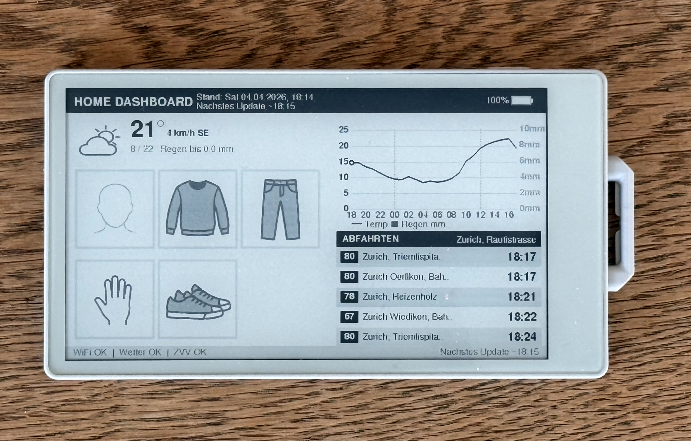

# M5Paper S3 Home Dashboard

E-ink home dashboard for the M5Paper S3 (ESP32-S3, 960×540 e-ink display). Shows weather, clothing recommendations, temperature/rain chart, and bus departures — with adaptive refresh rates to maximize battery life.

## Screenshots



## Architecture

```
┌─────────────────┐     HTTP/JSON      ┌──────────────────┐
│   M5Paper S3    │ ◄────────────────── │  Backend (FastAPI)│
│   (ESP32-S3)    │                     │  Cloud Run / local│
└─────────────────┘                     └──────┬───────────┘
                                               │
                              ┌────────────────┼────────────────┐
                              │                │                │
                    ┌─────────▼──┐   ┌─────────▼──┐   ┌────────▼───┐
                    │ Kachelmann │   │  Kitchen    │   │ transport  │
                    │ Weather API│   │  Display API│   │ .opendata  │
                    └────────────┘   └────────────┘   └────────────┘
                    Hourly forecast   Indoor/outdoor   ZVV bus
                    temp, rain, wind  temp, CO2        departures
```

## Project Structure

```
├── backend/             Python FastAPI backend
│   ├── main.py          Dashboard API endpoint
│   └── test_main.py     Unit tests (pytest)
├── m5paper_hw/          ESP-IDF firmware for M5Paper S3
│   └── main/
│       ├── main.cpp             Rendering + WiFi + HTTP fetch
│       ├── clothing_sprites.h   2-bit grayscale clothing icons (auto-generated)
│       └── weather_icons_2bit.h 2-bit grayscale weather icons (auto-generated)
├── assets/
│   └── sprites/         Source PNGs for clothing icons (150×150)
├── simulator/
│   ├── dashboard.py     Python dashboard mockup generator
│   └── icons/           Source PNGs for weather icons
├── tools/
│   ├── png_to_header.py     Converts PNGs to 2-bit C header arrays
│   └── package_release.py   Builds a publishable firmware bundle for end users
├── docs/
│   └── 发布给别人刷机.md
├── Taskfile.yml         Build/flash/monitor commands
└── CLAUDE.md            AI assistant context
```

## Dashboard Features

- **Weather**: Current outdoor temperature, weather icon, wind speed/direction
- **Clothing**: 5 recommendation cards (head, top, pants, hands, shoes) based on forecast
- **Chart**: 24h temperature line + rain bars (mm) starting from current hour
- **Bus departures**: Next departures from configured stop (ZVV)
  - **High mode**: Individual departure rows (up to 5)
  - **Low mode**: Compact view — one line per destination with all times in the next hour
- **Battery**: Real-time battery level from hardware

## Refresh Schedule

The backend determines the refresh mode based on time-of-day and weekday/weekend:

| Period | Weekday | Weekend | Interval |
|--------|---------|---------|----------|
| 05:00–09:00 | High (15 min) | High (15 min) | 15 min |
| 09:00–17:00 | Low (60 min) | High (15 min) | varies |
| 17:00–21:00 | Low (60 min) | Low (60 min) | 60 min |
| 21:00–05:00 | Sleep | Sleep | until 05:00 |

Estimated battery life: **2–4 weeks** on a single charge (1900 mAh).

## Prerequisites

- ESP-IDF v5.3 installed at `~/esp/esp-idf-v5.3`
- Python 3.x with `httpx`, `fastapi`, `uvicorn`, `python-dotenv`
- [Task](https://taskfile.dev/) runner

## Quick Start

### Backend

Windows one-click start:

```powershell
.\start_backend.bat
```

Keep the window open while M5Paper is using the backend. The script prints the local admin page and the LAN `/dashboard` URLs you can try from your phone or M5Paper.

Windows background start, with no server window to keep open:

```powershell
.\start_backend_background.bat
```

This starts the backend hidden and writes logs to `backend/backend.log` and `backend/backend.err.log`. To stop it later:

```powershell
.\stop_backend.bat
```

```bash
cd backend
python -m venv .venv
source .venv/bin/activate
pip install httpx fastapi uvicorn python-dotenv
task backend
```

### Firmware

```bash
# Build
task build

# Flash (device must be connected via USB)
task flash

# Flash + serial monitor
task flash-monitor

# If device is in deep sleep: hold Boot, press Reset, release Boot, then flash
```

### Publish for Others

After you build the firmware once, you can package a release bundle for non-developers:

```bash
task build
python tools/package_release.py --version v2026.04.15
```

The bundle will be written to `release_dist/` and includes:

- `flash_windows.bat` — Windows one-click flashing script
- `firmware/*.bin` — bootloader / partition table / app binaries
- `flash_manifest.json` — ESP Web Tools manifest
- `README_先看我.txt` — end-user Chinese flashing instructions

This means your users do not need to install ESP-IDF just to flash the device.

### GitHub Actions Build

The repository can also build firmware directly on GitHub:

- Push a branch or open a pull request: GitHub Actions will run backend checks and compile the ESP-IDF firmware.
- Push a tag like `v1.0.0`: Actions will compile the firmware, package the Windows flashing bundle, and attach the zip to the GitHub Release.
- In the Actions page, you can download the artifact named `m5paper-dashboard-<version>` without building locally.

### Regenerate Sprites

```bash
python3 tools/png_to_header.py
```

## Configuration

### Backend (`backend/.env`)

```
KACHELMANN_API_KEY=...
WEATHER_LATITUDE=47.382
WEATHER_LONGITUDE=8.482
BUS_STOP_NAME=Zürich, Rautistrasse
```

### Firmware (`m5paper_hw/main/secrets.h`)

`secrets.h` now exists as a placeholder fallback. If the values are still placeholders, the device will auto-enter SoftAP setup mode on first boot. You can still edit it manually if you want a baked-in default:

```c
#define WIFI_SSID       "your-ssid"
#define WIFI_PASS       "your-password"
#define API_URL         "https://your-backend/dashboard"
```

### Running Tests

```bash
cd backend
.venv/bin/python -m pytest test_main.py -v
```

### Deployment (Cloud Run)

```bash
cd backend
gcloud run deploy m5paper-dashboard --source . --region europe-west6 --allow-unauthenticated
gcloud run services update m5paper-dashboard --region europe-west6 \
  --set-env-vars "KACHELMANN_API_KEY=..." \
  --set-env-vars "BUS_STOP_NAME=Zürich, Rautistrasse"
```

---
Updated: 2026-04-05
